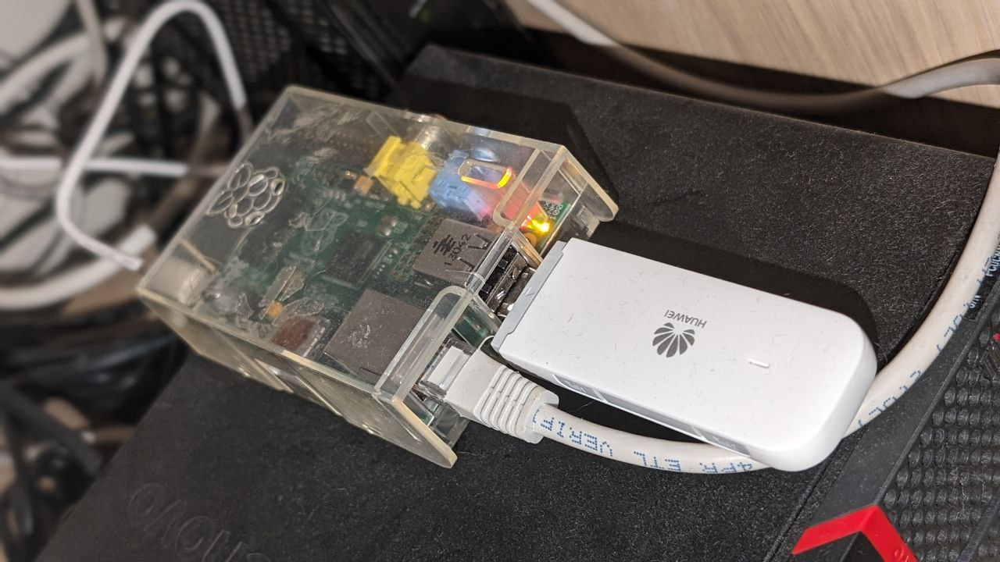

# sms-gateway
[](https://github.com/jatm80/sms-gateway/actions/workflows/ci.yaml)



## Requirements
- Huawei E3372 USB Modem
- Some compute (raspberry pi, docker)

## Using sms-gateway

* Generate self signed certificate:
```
openssl req -newkey rsa:4096 -sha256 -nodes -keyout PRIVATE.key -x509 -days 365 -out PUBLIC.pem
```
* Run the service:

```
export TELEGRAM_TOKEN=123:abc 
export TELEGRAM_CHAT_ID=567
export CERT_PATH=PUBLIC.pem
export KEY_PATH=PRIVATE.key
./sms-gateway
```
Enviroment variables:
- TELEGRAM_TOKEN: Required
- TELEGRAM_CHAT_ID: Required
- CERT_PATH: Required either self-signed or signed
- KEY_PATH: Required either self-signed or signed
- BIND_ADDRESS_PORT: defaults to 8443
- DEFAULT_BASE_URL:  defaults to `http://192.168.8.1`

## Deploy using ansible in `deploy/ansible-playbook`


* `inventory.ini` update the remote IP and ansible_user   
```
[raspberry_pi]
192.168.1.100 ansible_user=pi ansible_ssh_private_key_file=~/.ssh/id_rsa
```

* `sms-gateway.yaml`  update the variables with the right information:
```
    country: "US"
    state: "New Jersey"
    locality: "Gotham City"
    organization: "jondoe"
    organizational_unit: "None"
    common_name: "sms-bot.example.com"
    email: "webmaster@example.com"
    env_vars:
      TELEGRAM_TOKEN: "your telegram bot token"
      TELEGRAM_CHAT_ID: "your telegram bot chat id"
```

* Run ansible-playbook:

```
cd deploy/ansible-playbook/
ansible-playbook -i inventory.ini sms-gateway.yaml
```

* Adjust Iptables in the remote server to limit traffic to Telegram (sample):
```
#!/bin/bash

sudo sysctl net.ipv4.ip_forward=1

# Flush existing rules and chains
sudo iptables -F
sudo iptables -X

# Set default policies to ACCEPT
sudo iptables -P INPUT ACCEPT
sudo iptables -P FORWARD ACCEPT
sudo iptables -P OUTPUT ACCEPT

# Enable NAT (if needed)
sudo iptables -t nat -A POSTROUTING -o eth1 -j MASQUERADE

# Allow traffic forwarding between interfaces
sudo iptables -A FORWARD -i eth0 -o eth1 -j ACCEPT

# Allow Telegram traffic
sudo iptables -A INPUT -i eth0 -p tcp -m tcp -s 149.154.160.0/20,91.108.4.0/22 --dport 8443 -j ACCEPT
sudo iptables -A INPUT -i eth0 -p tcp -m tcp -s 192.168.11.0/24 --dport 8443 -j ACCEPT
sudo iptables -A INPUT -i eth0 -p tcp -m tcp --dport 8443 -j REJECT
```

## Configure Telegram Bot with Self signed certificate
* Modify the file in `scripts/self-signed-cert.html` and defined the following:
```
        token: 'xxx',
        port: 8443,
        host: 'your-url-host',

  // token: is your telegram bot token.  
  // port: is the exposed port of the service sms-gateway. Telegram only allows for 443 or 8443.
  // host: is the url to reach to service sms-gateway once deployed.         
```  

* Click in `Set Webhook`, Telegram will respond with the URL of the webhook


## References:
* https://www.0xf8.org/2017/01/flashing-a-huawei-e3372h-4g-lte-stick-from-hilink-to-stick-mode/
* https://stephenmonro.wordpress.com/2019/02/13/getting-sms-messages-from-the-huawei-e3372-lte-modem/
* https://medium.com/swlh/build-a-telegram-bot-in-go-in-9-minutes-e06ad38acef1
* https://core.telegram.org/bots/webhooks
* https://core.telegram.org/bots/webhooks#how-do-i-set-a-webhook-for-either-type
